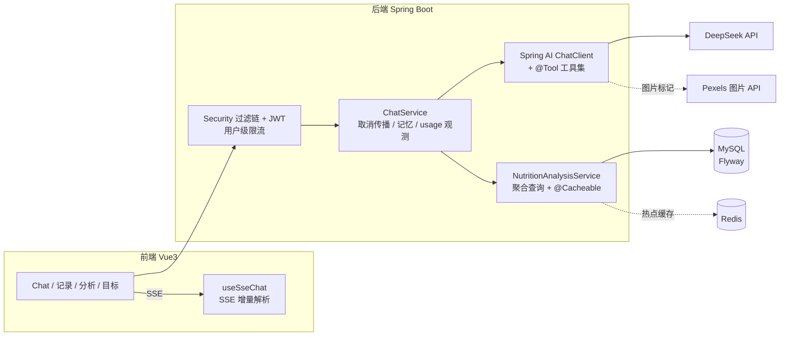

# xin-diet-agent · AI 饮食管理智能体

面向个人的 AI 营养师：**AI 流式对话 + 饮食记录 + 营养分析 + 目标管理** 的一体化全栈 Web 应用。
AI 基于你的真实身体数据与当日饮食给出个性化建议，支持按需查询任意日期的历史数据、流式打字机输出、一键停止、对话内搜索食物图片。

> 后端 Java 17 / Spring Boot 3.5 / Spring AI 1.1 · 前端 Vue 3 / Vite · 存储 MySQL · 缓存 Redis · 大模型 DeepSeek

## 功能特性

- **AI 营养师对话（SSE 流式）**：打字机效果实时渲染 markdown；生成中可一键停止，停止与断开都会**立即取消上游大模型调用**，不空烧 token 费用。
- **混合式数据接入架构**：今日画像/饮食/营养汇总预注入提示词（高频问题零工具往返）；历史日期通过 **原生 function calling（`@Tool`）** 按需查询——支持任意日期的饮食记录、单日/每周营养汇总与用户画像。
- **动嘴记录饮食**：对话中说"我中午吃了一碗米饭"，AI 估算营养并调用 `addDietRecord` 工具落库（注明估算值、份量不明先确认），可在饮食记录页修改或删除。
- **对话内图片搜索**：模型输出 `[搜索图片: 关键词]` 标记，服务端调用 Pexels API 生成富媒体卡片并全量替换下发；第三方数据全部 HTML 转义 + 前端 DOMPurify 净化，杜绝 XSS。
- **多用户隔离与安全**：JWT 无状态认证 + BCrypt；所有数据查询与 AI 工具实例都绑定 token 中的用户身份；对话接口按用户令牌桶限流，保护 API 账单。
- **营养日报/周报**：单条聚合 SQL 计算四项营养汇总与目标达成度，Redis 60s 热点缓存（连接失败自动降级直查数据库）。
- **对话记忆持久化**：滑动窗口 20 条持久化到 MySQL——重启不丢失、多实例共享；进程内 Caffeine 读穿透缓存，连续多轮对话零查库。
- **成本可观测**：每次 AI 调用的模型、三类 token 用量与耗时落库，个人设置页展示用量统计看板（`/api/agent/usage`），统计旁路故障不影响对话主链路。
- **数据库版本化**：Flyway 管理表结构演进，禁止 Hibernate 擅自改表。

## 架构总览



## 快速开始

### 方式一：Docker Compose 一键启动（推荐）

```bash
# 先在环境变量或 .env 文件中提供密钥
export DEEPSEEK_API_KEY=sk-xxxx        # 必填
export PEXELS_API_KEY=xxxx             # 图片搜索，可选
export DB_PASSWORD=your-mysql-pwd      # 可选，默认 diet123456

docker compose up --build
```

启动后访问 <http://localhost:5173>（前端 Nginx 同源代理 `/api` 到后端，浏览器侧无跨域）。

### 方式二：本地手动启动

前置要求：JDK 17、Maven 3.9+、Node 18+、MySQL 8、Redis（可选，缺失时缓存自动降级）。

```bash
# 1. 数据库：建库 diet_agent 即可，表结构由 Flyway 首次启动自动创建
mysql -uroot -p -e "CREATE DATABASE IF NOT EXISTS diet_agent DEFAULT CHARSET utf8mb4"

# 2. 后端：在项目根目录 .env 中填好 DEEPSEEK_API_KEY / JWT_SECRET
#    （.env 由 spring.config.import 原生读取，IDEA 与 mvn 启动均生效；
#      JWT_SECRET 可用 openssl rand -hex 32 生成，至少 32 字节，启动时校验）
mvn -s .mvn-online-settings.xml spring-boot:run

# 3. 前端
cd frontend && npm install && npm run dev   # http://localhost:5173
```

### 环境变量

| 变量 | 必填 | 说明 |
|---|---|---|
| `DEEPSEEK_API_KEY` | ✅ | DeepSeek 大模型 API Key |
| `JWT_SECRET` | ✅ | JWT 签名密钥，≥ 32 字节，不足启动即失败 |
| `DB_PASSWORD` / `DB_HOST` / `DB_USERNAME` | | MySQL 连接信息，默认 `localhost` / `root` |
| `REDIS_HOST` / `REDIS_PORT` | | 默认 `localhost:6379`，不可用时缓存优雅降级 |
| `PEXELS_API_KEY` | | 图片搜索功能依赖 |
| `SPRING_PROFILES_ACTIVE` | | `dev`（默认，详细日志）/ `prod`（收敛日志） |

## 单元测试

```bash
mvn -s .mvn-online-settings.xml test
```

覆盖：JWT 签发/解析/过期/篡改/弱密钥拒绝、对话记忆 FIFO 截断、营养汇总聚合换算与进度封顶、AI 工具日期解析兜底。

## 项目结构

```
├── src/main/java/com/dietagent
│   ├── agent/
│   │   ├── memory/     # 对话记忆：MySQL 持久化 + Caffeine 读穿透（滑动窗口 20 条）
│   │   ├── prompt/     # 系统提示词（画像 + 混合工具策略）
│   │   └── tool/       # @Tool 数据查询/记录工具集 / Pexels 图片卡片
│   ├── config/         # Security/JWT、ChatClient、缓存（Redis 降级）、限流
│   ├── controller/     # Agent 对话（SSE）、认证、饮食记录、分析、目标
│   ├── ratelimit/      # 用户级令牌桶
│   ├── repository/     # JPA（含单条聚合查询）
│   └── service/        # 业务逻辑
├── src/main/resources/db/migration   # Flyway 迁移脚本
├── frontend/src
│   ├── composables/useSseChat.js      # SSE 增量解析（与 UI 解耦、可复用）
│   └── views/                          # 对话 / 记录 / 分析 / 目标 / 设置
├── Dockerfile · frontend/Dockerfile · docker-compose.yml
└── 项目经历.md / 项目难点.md            # 设计取舍与难点复盘
```

## 设计取舍速览（详细版见 项目难点.md）

| 决策 | 取舍 |
|---|---|
| 停止生成 = 取消上游调用 | `takeUntilOther` 挂接停止信号 + Reactor 取消传播，客户端断开同样立即终止，不再空烧 API 费用；已生成部分照常写入记忆 |
| 今日数据预注入 + 历史走工具 | 高频问题零工具往返、低延迟；历史日期由模型按需调用 `@Tool`，解决早期方案只能感知"今天"的局限 |
| 图片搜索保留标记协议而非工具 | 工具结果需回灌模型再生成（token 浪费 + 内容可能被改写）；标记协议由服务端确定性替换，零 token、零失真 |
| Redis 缓存 + 降级 errorHandler | 缓存纯做优化层，连接失败记日志直查数据库，部署环境没有 Redis 也能跑 |
| AI 工具请求级绑定 userId | 工具实例按请求构造，模型只能查当前登录用户的数据，从接口层杜绝越权 |
